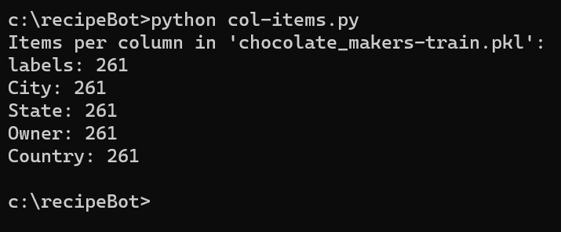
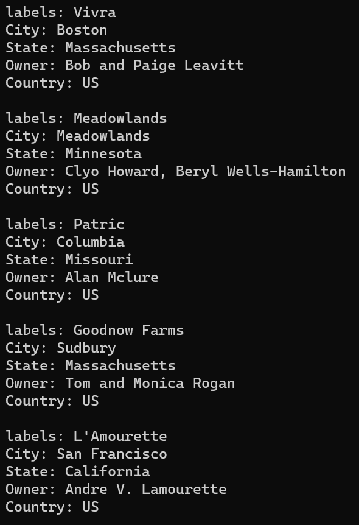

<h1>Ultimate Kitchen Companion Chatbot</h1>
Here you will find all of the scripts that I am using to train the ultimate kitchen companion in the form of an AI chatbot. This bot will be able to suggest recipes based on myriad factors such as taste, ethnicity, type, caloric content and more! Think, "I'd like a recipe for an Indian dish that isn't too spicy and has under 400 calories."
<h4>Below you will find explanations of each script and how they need to be modified to be used</h4>
<h2>tr-eval-split.py</h2>
<h3>This script takes a .csv file and performs the following actions:</h3>
<ol>
  <li>Renames a unique column as "labels" (Ex. The "Company Name" in the chocolate_makers.csv dataset. There would never in this instance be two seperate lines for the same company, therefore this column is unique, unlike "City", which may see repeated values throughout the dataset) to give each data entry one unique identifier</li> 
  <li>Cleans and normalizes the data (the chocolate_makers.csv dataset was well formatted and required no special cleaning or normalization, but there is a section for this)</li> 
  <li>Targets and converts all of the column names in the dataset into keys (you will still use line #15, 'labels: labels', for whatever column you changed to be 'labels'. Do not remove this)</li> 
  <li>Splits the dataset into 2 different sets, training (70%) and evaluation (30%). The training files will be carried into the next step and the evaluation files will be saved for testing the trained AI model</li> 
  <li>Converts the DataFrames into dictionaries</li>
  <li>Saves the resulting training and evaluation output files as 2 seperate .pkl files</li>
</ol>
<h3>To use this script, you will need to modify the following:</h3>
<ol>
  <li>Line #5 must be modified to include the path to your .csv dataset</li>
  <li>Line #8 must be modified to include the name of a unique column in your dataset</li>
  <li>The array defined at like #14 must include the name of the dataset columns on the left and what you're renaming them to on the right. Line #15 should remain in every instance</li>
  <li>The paths to save the newly created .pkl files must be inserted at lines #29 and #32</li>
</ol>
<h2>col-details.py</h2>
This script should be run on each .pkl file after they are created with <em>tr-eval-split.py</em> to ensure that each column has the same number of items as well as the correct column name. The total number of columns will also be displayed. If there is a mismatch in items per column, the <em>train.py</em> script will not execute properly. If there is, it is likely due to improper data normalization in the <em>tr-eval-split.py</em> script. If all of your data has been converted and normalized properly, the issue may lie witin the dataset itself. If all of your colums have the same number of entries, good job! This can be quite the task if your dataset is poorly formatted. You will need the total # of items per column for the <em>train.py</em> script (261 in this case)

&nbsp

<h4>To use this script, simply change line #5 to have the correct file path to your .pkl file</h4>
<h2>col-literal.py</h2>
This script is included for debugging and verification and will display the items in each line of the dataset as their own block if you need to visually inspect the data structure for any reason.

&nbsp

&nbsp

<h4>To use this script, simply change line #5 to have the correct file path to your .pkl file</h4>
<h2>train.py</h2>
This is the actual training script for the bot. A high level breakdown is as follows:

&nbsp

<ol>
  <li>The script has a defined random value to begin training from set in the env; a seed. For reproducable results, this must be included and remain unchanged throughout the training process</li>
  <li>The data from the .pkl file(s) is loaded in and normalized</li>
  <li>The training data is then split again into 2 sets, training (80%) and validation (20%)</li>
  <li>The number of iterations (epochs here) and batch size are defined</li>
  <li>The bot runs through the Training, Validation and Evaluation loops, improving on it's learning capabilities each loop until the total number of iterations is reached, whereupon the final files, our "trained AI" are saved as .h5 files</li>
</ol>
I am currently debugging the train/validate/evaluate loop as it is not fully functional yet. This project will have updates posted at the top of this ReadMe.

